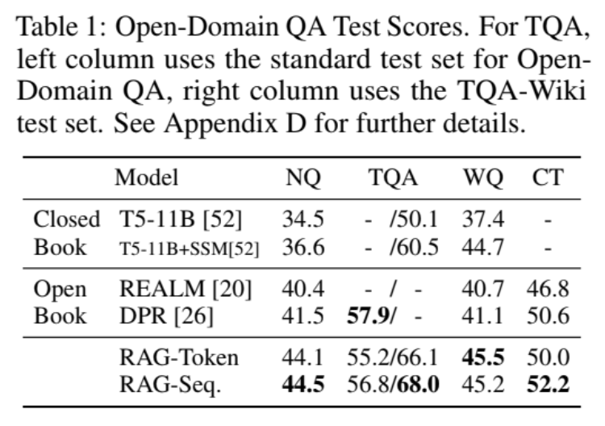

# RAGs to Riches: A Reimplementation of RAG for Knowledge-Intensive NLP Tasks

This repository contains the Cornell CS 4782 final group project, a reimplementation of [Retrieval-Augmented Generation for Knowledge-Intensive NLP Tasks](https://arxiv.org/abs/2005.11401) by Lewis et al. (2020). We reproduce a simplified version of the Natural Questions result from table 1 of the original paper, focusing on whether retrieval-augmented generation improves factual open-domain question answering.

## Introduction

Closed-book models such as T5 rely only on parametric memory, which can lead to missing facts or hallucinated answers. Retrieval-Augmented Generation (RAG) addresses this by retrieving relevant passages from an external corpus before generating an answer. This project compares four systems:

| Model | Role |
|---|---|
| T5-base | Closed-book baseline |
| DPR | Retrieval-only baseline |
| RAG-Token | Retrieval-augmented generator with token-level marginalization |
| RAG-Sequence | Retrieval-augmented generator with sequence-level marginalization |

## Chosen Result

We aimed to reproduce Table 1 (Natural Questions) from Lewis et al. (2020), which compares closed-book and open-book QA models. The key claim: RAG variants outperform T5 and DPR baselines on factual open-domain QA. 
<br>

<p align="center">
  <strong>Original Table 1 from the RAG paper</strong>
</p>

<p align="center">
  
</p>
Due to Google Colab compute and storage constraints, our goal was to reproduce the *trend* rather than exact scores.

## GitHub Contents
 
```
RAGs-to-Riches/
├── code/
│   ├── notebooks/
│   │   ├── t5_eval.ipynb
│   │   ├── dpr_eval.ipynb
│   │   ├── rag_token_train_eval.ipynb
│   │   ├── rag_sequence_train_eval.ipynb
│   │   └── final_comparison.ipynb
├── data/
│   └── README.md              ← dataset loaded automatically, no download needed
├── results/
│   ├── RAG_SEQ_RESULTS/
│   │   ├── rag_sequence_k_1_results.csv
│   │   ├── rag_sequence_k_3_results.csv
│   │   ├── rag_sequence_k_5_results.csv
│   │   ├── rag_sequence_k_10_results.csv
│   │   ├── rag_sequence_k_experiment_summary.csv
│   │   └── rag_sequence_results.csv
│   ├── RAG_TOKEN_RESULTS/
│   │   ├── rag_token_k_1_results.csv
│   │   ├── rag_token_k_3_results.csv
│   │   ├── rag_token_k_5_results.csv
│   │   ├── rag_token_k_10_results.csv
│   │   ├── rag_token_k_experiment_summary.csv
│   │   └── rag_token_results.csv
│   ├── dpr_results.csv
│   └── t5_eval_results.csv
├── poster/
│   └── 135_RAGs to Riches.pdf
├── report/
│   └── 135_Retrieval-Augmented Generation for Knowledge-Intensive NLP Tasks_2page_report.pdf
├── README.md
├── LICENSE
└── .gitignore
```

## Re-implementation Details


We used `t5-base` as a closed-book baseline, DPR + FAISS for retrieval, and `facebook/bart-base` as the generator for both RAG variants, trained on 10,000 NQ examples with 10,000 SQuAD passages as a proxy retrieval corpus. Key modifications: BART-base instead of BART-large (memory), SQuAD instead of Wikipedia (storage), token-level F1 instead of Exact Match, and 1,000 eval examples instead of the full NQ test set.

**Additional experiment:** We tested retrieval depth k ∈ {1, 3, 5, 10} on both RAG variants to analyze how the number of retrieved passages affects performance.

## Reproduction Steps

**Dependencies** — install via pip in a Colab GPU runtime:
```
pip install transformers "datasets<3" sentencepiece accelerate faiss-cpu
```

Run the notebooks in `code/notebooks/` in this order:

1. `t5_eval.ipynb` — evaluates the closed-book T5-base baseline
2. `dpr_eval.ipynb` — evaluates retrieval quality using DPR + FAISS
3. `rag_token_train_eval.ipynb` — trains and evaluates RAG-Token
4. `rag_sequence_train_eval.ipynb` — trains and evaluates RAG-Sequence
5. `final_comparison.ipynb` — combines all CSV outputs into the final comparison table

**Compute:** A GPU runtime is required for the RAG notebooks (each trains for 3 epochs over 10,000 examples). Output CSVs have been pre-computed and are available directly in results/.

## Results / Insights

| Book Type | Model | Paper NQ (EM) | Our NQ (F1) |
|---|---|---|---|
| Closed Book | T5 (paper: T5-11B, ours: T5-base) | 34.5 | 8.1 |
| Open Book | DPR | 41.5 | 13.73 |
| Open Book | RAG-Token | 44.1 | 33.8 |
| Open Book | RAG-Sequence | 44.5 | 31.44 |

RAG variants substantially outperformed the T5 and DPR baselines, reproducing the main trend from the paper. The absolute scores are lower due to using smaller models and a proxy retrieval corpus. Our additional experiment found that retrieval depth (k) provided marginal gains for RAG-Token but had almost no effect on RAG-Sequence (F1 remained ~31.48 across all k values), suggesting RAG-Sequence's reliance on a single top-ranked document makes it less sensitive to retrieval breadth at this scale.

The central bottleneck is retrieval quality: DPR frequently retrieved irrelevant SQuAD passages for NQ questions (Recall@10 ≈ 0), which cascaded into weaker generation.

## Conclusion

RAG models outperformed closed-book and retrieval-only baselines, confirming that access to external evidence improves factual open-domain QA even at small scale. Retrieval quality is the primary bottleneck: weak retrieved passages reliably lead to weak generated answers. Future work should scale to the full Wikipedia corpus, use larger generators, and explore contrastive retrieval training to penalize ungrounded outputs.

## References

[1] Patrick Lewis et al., "Retrieval-Augmented Generation for Knowledge-Intensive NLP Tasks," NeurIPS, 2020.

[2] Vladimir Karpukhin et al., "Dense Passage Retrieval for Open-Domain Question Answering," EMNLP, 2020.

[3] Mike Lewis et al., "BART: Denoising Sequence-to-Sequence Pre-training for Natural Language Generation, Translation, and Comprehension," ACL, 2020.

[4] Tom Kwiatkowski et al., "Natural Questions: A Benchmark for Question Answering Research," TACL, 2019.

[5] Pranav Rajpurkar et al., "SQuAD: 100,000+ Questions for Machine Comprehension of Text," EMNLP, 2016.

[6] Colin Raffel et al., "Exploring the Limits of Transfer Learning with a Unified Text-to-Text Transformer," JMLR, 2020.

## Acknowledgements

This project was completed as part of CS 4782: Introduction to Deep Learning at Cornell University. We are grateful to the course staff for their guidance and support.
